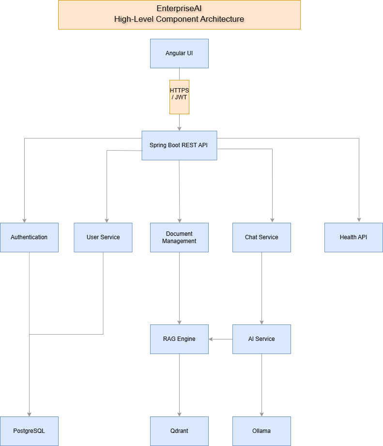

# EnterpriseAI - Architecture Overview

## Introduction

EnterpriseAI is a self-hosted enterprise AI platform designed to help organizations search, understand and interact with internal knowledge using natural language.

The platform combines Retrieval-Augmented Generation (RAG), local Large Language Models (LLMs) and a modular software architecture to provide secure and intelligent access to company documentation.

---

## Vision

EnterpriseAI is designed to provide a centralized knowledge platform where employees can:

- Search internal documentation
- Ask questions using natural language
- Upload and manage company documents
- Retrieve trustworthy answers based on indexed content
- Keep all sensitive information inside the organization

---

## Technology Stack

### Frontend
- Angular

### Backend
- Spring Boot

### AI Runtime
- Ollama

### Large Language Model
- Qwen 3

### Vector Database
- Qdrant

### Relational Database
- PostgreSQL

### Containerization
- Docker

### Documentation
- Markdown

### Version Control
- Git & GitHub

---

## High-Level Architecture

The platform follows a modular architecture where each component has a single responsibility.


This architecture promotes:

- Scalability
- Maintainability
- Loose coupling
- Easy extensibility


## High-Level Component Diagram

The following diagram illustrates the high-level architecture of EnterpriseAI.



---

## Core Modules

The system is composed of the following modules:

- Authentication
- User Management
- AI Service
- Chat
- Document Management
- Retrieval-Augmented Generation (RAG)
- Knowledge Search
- Health Monitoring

Each module is designed to operate independently while communicating through the Spring Boot REST API.

---

## RAG Workflow

```text
PDF / DOCX

↓

Document Parser

↓

Text Extraction

↓

Text Chunking

↓

Embedding Generation
(Vector Embeddings)

↓

Qdrant

↓

Semantic Search

↓

Relevant Context

↓

Prompt Builder

↓

Ollama

↓

Final Response
```

---

## Design Principles

EnterpriseAI follows several architectural principles:

- Self-hosted by design
- Modular architecture
- Security first
- Privacy focused
- Enterprise ready
- Easy to maintain
- Easily extensible
- Separation of concerns

---

## Related Documentation

The following documents provide additional architectural details:

- backend-architecture.md
- modules.md
- database-model.md
- use-cases.md

Additional architecture diagrams and design documents will be added throughout Sprint 2.